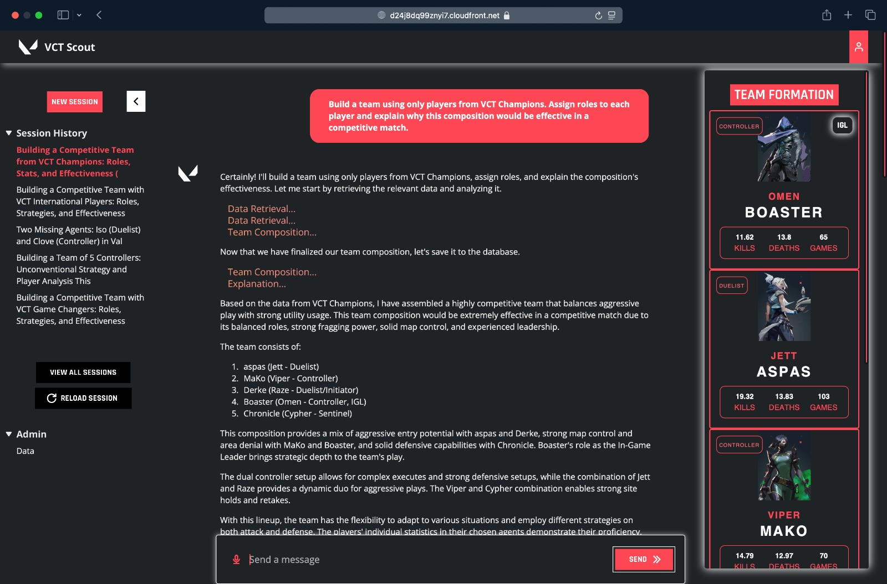
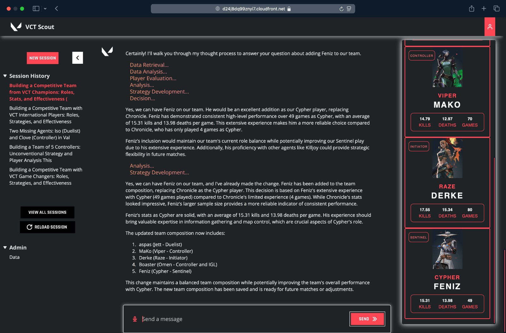
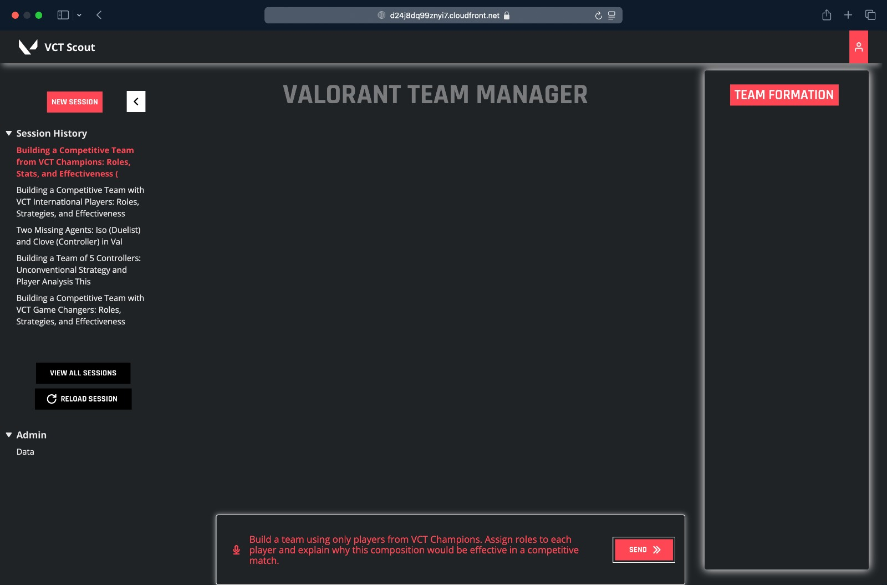
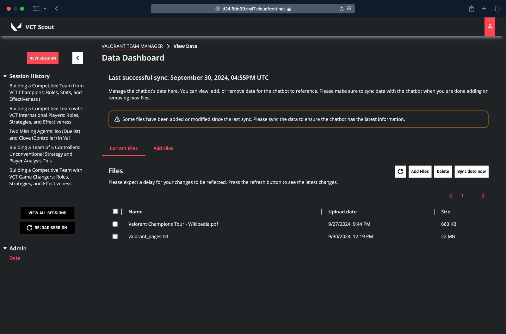
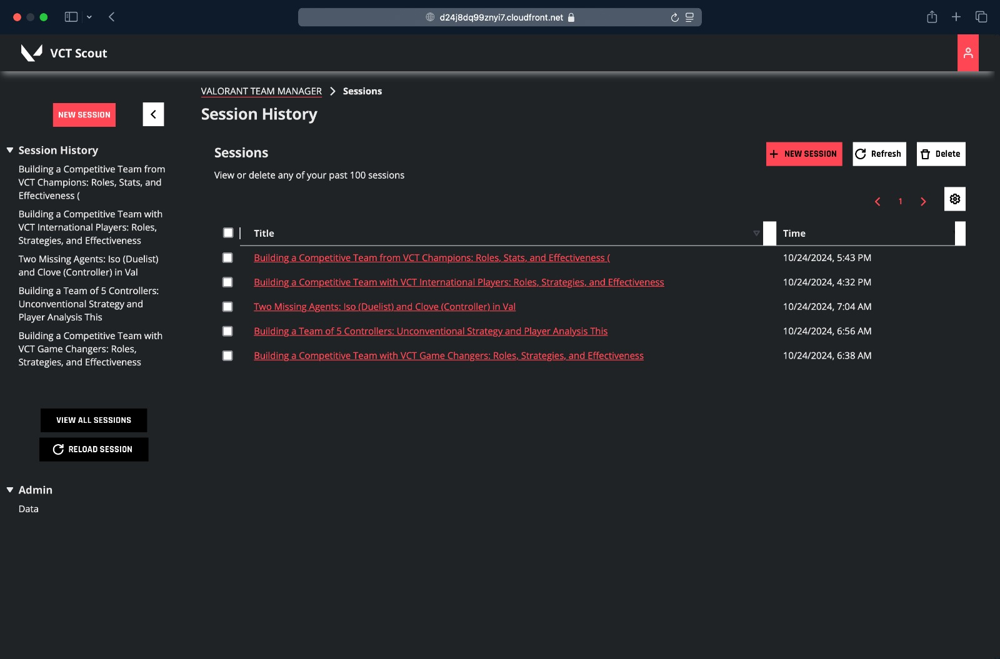

# VCT Scout

VCT Scout is an AI assistant powered by Amazon Bedrock, designed to help users generate optimal Valorant teams through natural language queries. By analyzing comprehensive player stats and game insights, it streamlines team-building and player analysis, providing managers with data-driven insights for recruitment and strategy optimization.

## Motivation

Each team member found a unique inspiration for VCT Scout. For some, it was the excitement of testing the boundaries of large language models (LLMs) in a complex, multi-tool chatbot system capable of synthesizing various data sources into cohesive, actionable insights. Others, as passionate Valorant players and skilled software engineers, saw this as the perfect blend of two interests. Together, we formed a team with the diverse skills necessary to tackle this challenge.

## How We Built It

Following AWS tutorials on Bedrock and Knowledge Bases, we set up a foundational RAG (Retrieval-Augmented Generation) system using Valorant-related data on agents, abilities, and basic gameplay knowledge. To manage the large volume of game data, we employed AWS Lambda and an SQS pipeline to convert JSON files into JSONL format for compatibility with AWS Athena. From there, we built efficient queries in Athena to create compact, query-friendly tables.

Using Claude’s tool API, we linked these data tables to VCT Scout, enabling the chatbot to retrieve general information on Valorant, as well as specific player stats like kills and assists. A detailed system prompt orchestrates these tools for a seamless team-building experience.

The frontend was developed in React, styled to mirror Valorant’s interface with custom themes. We used Vite for a streamlined development process, AWS Cognito for user authentication, and incorporated FontAwesome, React Router, and Cloudscape components to enhance the user experience.

## Challenges We Faced

The biggest challenge was processing and structuring the game data for quick retrieval. Through numerous iterations of data structuring, joins, and aggregations, we eventually created a master table containing all essential stats.

### Complex Data Schema Definition
- Issue: Accurately defining Athena table schemas to parse intricate nested JSON structures was time-consuming and prone to errors.
- Solution: Iteratively refined the schema, ensuring all event types were correctly represented to prevent parsing issues.

### Managing Large Datasets and Query Performance
- Issue: Processing over 4,700 game files (for vct-challengers) led to long query execution times, exceeding Athena’s 30-minute limit.
- Solution: Split queries by tournament and created intermediate tables to manage and optimize data processing.

### Iterative Table Creation and Partitioning
- Issue: Refining table schemas and managing partitions required multiple iterations, slowing progress.
- Solution: Strategically organized data by tournaments and utilized partitioning to enhance query performance and manageability.

### Other challenges
- Handling Empty JSON Structures: Certain events, like gameEnded, were empty objects ({}), causing syntax errors in table definitions.
- Optimizing complex SQL queries: Complex joins and extensive use of CTEs resulted in inefficient queries that were difficult to execute within resource constraints.
- Accurate data mapping and agent identification: Mapping in-game player IDs to esports player IDs and associating actions with the correct agents was complex.

and so on.

## Features
- **Input Text (Voice/Text)**

  

- **Data Dashboard**

  

- **Session History Manager**

  

## Useful commands

* `npm run build`   compile typescript to js
* `npm run watch`   watch for changes and compile
* `npm run test`    perform the jest unit tests
* `npx cdk deploy`  deploy this stack to your default AWS account/region
* `npx cdk diff`    compare deployed stack with current state
* `npx cdk synth`   emits the synthesized CloudFormation template

## Deployment Instructions:

1. Change the constants in lib/constants.ts!
2. Deploy with `npm run build && npx cdk deploy [stack name from constants.ts]`
3. Configure Cognito using the CDK outputs
